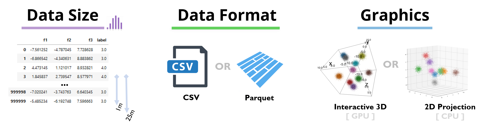

<!--  -->

# Hyperparamter Optimzation using RAPIDS and DASK

Notebook Table of Contents: 

1. [ Generate a classification dataset on GPU ](#data-load) (e.g., double helix, unwinding helix/whirl )

2. [ ETL - process/prepare data for model training ](#ETL) (e.g., scale, split, augment )   
    
3. [ Define HPO Strategy ](#define-hpo)

4. [ Create Compute Cluster ](#compute-cluster)
   > LocalCUDACluster or KubeCluster
      
5. [ Define Seach ](#define-search)

6. [ Run ASYNC Particle Swarm ](#run-async-PSO)

7. [ Run Classic Particle Swarm ](#run-classic-PSO)

8. [ Run Random Search Baseline ](#run-random-search)

9. [ Summary ](#summary)

## Install and Run Demo

1 -- clone repository

```git clone https://github.com/miroenev/rapids ```

2 -- build container [ Dockerfile in  HPO/docker directory ] [takes 5-10 minutes]

```cd rapids/HPO/docker && sudo docker build -t rapids-dask-hpo .```

3 -- launch/run the container [auto starts jupyterlab server]

```sudo docker run --runtime=nvidia -it -p 8888:8888 -p 8787:8787 rapids-dask-hpo```

4 -- connect to the notebook

> navigate browser to the IP of the machine running the container
e.g., http://127.0.0.1:8888

> In the /rapids/HPO/ directory open the notebook XX-XX-2019_rapids_dask_hpo.ipynb

## Using the CLI

1 -- get help on CLI options

``` python main.py --help```

2 -- launch experiments

```python main.py --num_gpus 4 --num_timesteps 10 --coil_type 'helix'```

## Using Kubeflow and Dask-Kubernetes

1 -- install Kubernetes, Ceph, and Kubeflow from [NVIDIA/deepops](https://github.com/NVIDIA/deepops/blob/master/docs/kubernetes-cluster.md)

2 -- navigate to the Kubeflow dashboard, select notebooks and create a new notebook server using the custom container

```ericharper/rapids-dask-hpo:latest```

3 -- change the run command

>\["-c", "/opt/conda/envs/rapids/bin/jupyter lab  --notebook-dir=/ --ip=0.0.0.0 --no-browser --allow-root --port=8888 --NotebookApp.token='' --NotebookApp.password='' --NotebookApp.allow_origin='*' --NotebookApp.base_url=\$\{NB_PREFIX\}"\]

4 -- launch experiments via the notebook or the command line
```
!python main.py --k8s --adapt --num_gpus 4 --min_gpus 1 \
                --num_timesteps 10 --coil_type 'helix'
```

4 -- if the dask-kubernetes python kernel is shutdown before scaling down the workers, zombie workers may persist, use this command to clean up the dask-kubernetes workers from k8s

```sh
pods="";
for i in `kubectl get pods -n kubeflow | grep dask-root- | awk '{print $1}'`; 
```
do pods="${pods} ${i}"; done; echo "deleting ${pods}";  kubectl delete pods -n kubeflow ${pods}
```
